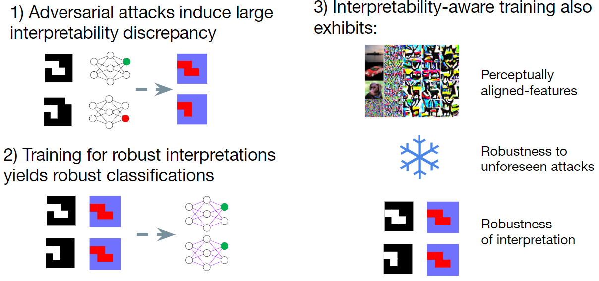

# Proper Network Interpretability Helps Adversarial Robustness in Classification

## Overview
This repository contains the code for [Proper Network Interpretability Helps Adversarial Robustness in Classification](https://arxiv.org/abs/2006.14748). In this work, we demonstrate that interpretability sneaking attacks (ISA) cannot reduce interptetation discrepancy below a certain level when using an appropriate discrepancy metric. We leverage this to design a interpretabilit-aware robust training method based directly on robust interpretation. Empirically, we demonstrate that interpretability-aware robust training can achieve robust classifications when facing large-perturbation attacks, as well as other benefits including robust interpretations and perceptually-aligned internal features.



## Setup

1. The following packages are required.
```
pip install numpy scipy scikit-learn scikit-image matplotlib opencv-python tensorflow-gpu
```
For running UAR attacks, pytorch is also required:
```
pip install torch torchvision
```

2. Clone this repository:

```
git clone https://github.com/AkhilanB/Interpretability.git
cd Interpretability
```

3. Train networks:
```
python3 train.py <number>
```
For `<number>` in 1-7. This will save all networks to `networks/`. Alternatively, use our pretrained networks in `networks/`.

## How to Run

### Running AAI, UAR, and PGD attacks
`eval.py` contains functions to evaluate networks under AAAI, UAR, and PGD attacks and visualize interpretation maps. The following functions are included:
```
vis_cam #Visualizes CAM interpretation maps for a network
intr_topk #Computes top-k intersection between the CAM interpretations of two different networks
aai_topk # Runs to-pk AAI and returns Tau rank correlation between original and perturbed interpretations
pgd_attack # Runs standard pgd attacks for a given perturbation size epsilon and returns PGD accuracy
min_pgd_attack # Runs minimum epsilon successful adversarial attacks and returns classification margins and interpretation discrepancies
uar_attack # Runs unforseen adversarial attacks and returns accuracy
```

All main experiment results can be run with: 
```
python3 eval.py 1
```
and additional experiment results can be run with:
```
python3 eval.py 2
```
The commands either print numerical results or generates plot in `gen_images\`.

### Running ISA
Results can be run with:
```
python3 eval_cmd.py --task <task> --dataset <dataset> --num_class <num_class> --num_image <num_image> --norm <norm> --network_type <network_type> --inp_method <inp_method> --network <network> --output_dir <output_dir> --penalties <penalties>
```
where `<task>` can be chosen from `["isa_cam", "tradeoff_cam", "tradeoff_ig", "tradeoff_repr", "isa_ig", "attack_and_display"]`, each corresponding to a different ISA evaluation. The command either prints numerical results or generates a plot in `gen_images\`.


## Files
setup_*.py contains code to import datasets. Currently, there is code to import mnist, cifar and restricted imagenet.

load_model.py contains a function `load_model` that takes a model architecture specification and a model file, and loads it into tensorflow. The function returns a `Model` object and contains functions that compute prediction output, CAM, GradCAM++ and IG.

train.py contains functions to train networks with different training methods. Each function trains a network with a different method. Running a training function will save a trained model in `networks\`. The bottom of the file contains scripts to train all networks. These scripts can be run with:
```
python3 train.py <number>
```
where each choice of `<number>` corresponds to a different set of networks.

eval.py contains functions to evaluate networks under AAI, UAR and PGD attacks. Functions either return numerical results or generates plots in `gen_images\`. 

eval_cmd.py provides a command line interface to evaluate networks with ISA. The script either prints numerical results or generates plots in `gen_images\`.

advex_uar/ contains code to run UAR attacks, adapted from the [source repository](https://github.com/ddkang/advex-uar).


